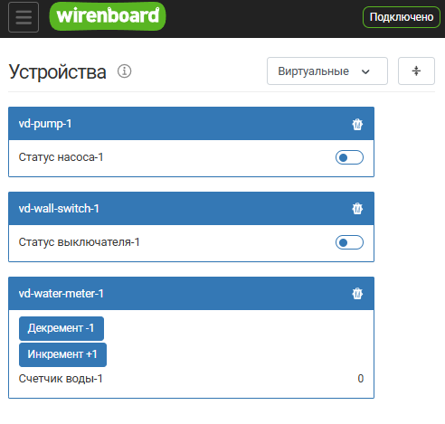

# Шаблон для создания простого deb-пакета

Этот репозиторий предоставляет шаблон для создания простых deb-пакетов\
посредством сборки инструментом `dpkg-buildpackage`. Данный пример пакета\
предназначен для установки на контроллеры Wiren Board.

Шаблон включает примеры виртуальных устройств, написанных на JavaScript,\
и необходимые скрипты для сборки пакета.

Результат работы с шаблоном - собственный deb-пакет: после его установки\
виртуальные устройства из примеров появятся в веб-интерфейсе контроллера\
на странице "Устройства":



## Термины

В процессе создания deb-пакета важно различать два термина:

- **Сборка** - это предварительная подготовка файлов проекта перед упаковкой\
  в пакет, например перемещение файлов, кросс-компиляция и т.д.\
  Этим шагом в `dpkg-buildpackage` занимается `debhelper`. В данном шаблоне\
  этап сборки сведен к простому копированию файлов.
- **Упаковка** - это процесс непосредственного создания deb-пакета из уже\
  готовых файлов. Этим шагом в `dpkg-buildpackage` занимается `dpkg-deb`.

Важно, что упаковка и сборка - это разные процессы. Упаковка не включает\
в себя сборку, так же как сборка не включает в себя упаковку.

## Содержание

- [Термины](#термины)
- [Содержание](#содержание)
- [Структура проекта](#структура-проекта)
- [Создание своего пакета на основе шаблона](#создание-своего-пакета-на-основе-шаблона)
  - [Установка необходимых инструментов](#установка-необходимых-инструментов)
  - [Клонирование репозитория](#клонирование-репозитория)
  - [Адаптация шаблона под свой пакет](#адаптация-шаблона-под-свой-пакет)
  - [Сборка пакета](#сборка-пакета)
- [Установка и удаление пакета](#установка-и-удаление-пакета)
  - [Установка](#установка)
  - [Удаление](#удаление)
- [Способ установки файлов](#способ-установки-файлов)
  - [Файл debian/install](#файл-debianinstall)
  - [Использование Makefile вместо debian/install](#использование-makefile-вместо-debianinstall)
- [Дополнительная информация](#дополнительная-информация)
  - [Скрипт postinst](#скрипт-postinst)
- [Лицензия](#лицензия)

## Структура проекта

```text
.
├── src/                          # исходные файлы JavaScript
│   ├── vd-pump-1.js              # пример виртуального насоса
│   ├── vd-wall-switch-1.js       # пример виртуального настенного выключателя
│   └── vd-water-meter-1.js       # пример виртуального счетчика воды
├── debian/                       # файлы, необходимые для сборки пакета
│   ├── changelog                 # лог изменений
│   ├── control                   # метаданные пакета и версия совместимости debhelper
│   ├── copyright                 # информация об авторских правах
│   ├── rules                     # скрипт сборки
│   ├── install                   # список файлов для установки и целевых директорий
│   └── postinst                  # скрипт, выполняемый после установки
├── webui-virtual-devices.png     # скриншот виртуальных устройств для документации
├── LICENSE                       # лицензия на использование программного обеспечения
├── .gitignore                    # файлы и директории, игнорируемые Git
├── .gitattributes                # принудительные LF-окончания строк для текстовых файлов
├── Jenkinsfile                   # конфигурация для CI/CD
└── README.md                     # документация (настоящее руководство)
```

## Создание своего пакета на основе шаблона

Этот раздел описывает весь путь от шаблона до готового deb-файла:\
установка инструментов, клонирование репозитория, адаптация шаблона\
под свои нужды и сборка.

### Установка необходимых инструментов

Убедитесь, что у вас установлены следующие пакеты:
- git - для клонирования репозитория c GitHub
- dpkg-buildpackage в пакете dpkg-dev - нужен для сборки в deb-пакет
- debhelper версии 11 или новее - его использует dpkg-buildpackage,\
  требуемая версия указана в `Build-Depends` файла `debian/control`

```terminal
$ sudo apt update && \
  sudo apt install git && \
  sudo apt install dpkg-dev && \
  sudo apt install debhelper
```

### Клонирование репозитория

Клонируйте репозиторий:

```terminal
$ git clone https://github.com/wirenboard/wb-git-template-dpkg-simple.git && \
  cd wb-git-template-dpkg-simple
```

В процессе разработки удобно клонировать свою ветку и сразу провести установку

```terminal
$ GIT_BRANCH_NAME="feature/add-template-files-first-iteration"
$ git clone -b "${GIT_BRANCH_NAME}" --single-branch "https://github.com/wirenboard/wb-git-template-dpkg-simple.git" && \
  cd wb-git-template-dpkg-simple
```

### Адаптация шаблона под свой пакет

Сейчас репозиторий собирает пакет-пример `wb-packagename`. Пройдите по\
шагам, чтобы превратить его в ваш собственный пакет:

1. **Замените исходные файлы**:
   - Положите в директорию `src/` свои скрипты вместо примеров `vd-*.js`.\
     Шаблон упаковывает все файлы `src/*.js`

2. **Задайте имя пакета**:

   - В `debian/control` замените `wb-packagename` на имя вашего пакета\
     в полях `Source` и `Package`. Имя может состоять только из строчных\
     латинских букв, цифр и символов `-`, `+`, `.`; пакеты для Wiren Board\
     принято называть с префиксом `wb-`

3. **Обновите остальные поля debian/control**:

   - Укажите себя в поле `Maintainer` и опишите ваш пакет в поле\
     `Description`: первая строка - краткое описание, ниже - развернутое,\
     каждая его строка начинается с одного пробела
   - Проверьте зависимости в поле `Depends`: зависимость `wb-rules`\
     нужна, пока ваши скрипты - это правила для движка wb-rules

4. **Обновите debian/changelog**:

   - Замените имя пакета в первой строке - оно должно совпадать с полем\
     `Source` из `debian/control`. Версия из последней записи попадет\
     в имя собранного deb-файла
   - Формат файла строгий, поэтому новые записи можно добавлять\
     инструментом `dch` или копировать старые записи и делать новые\
     на их основе. Будьте внимательны: типичные ошибки при ручном\
     редактировании - удаленные или лишние пробелы в отступах\
     и неверный день недели в дате

5. **Отредактируйте debian/install**:
   - Укажите в файле `debian/install`, какие файлы и в какие директории\
     должны быть установлены. О том, как выбрать директорию установки,\
     читайте в разделе [Способ установки файлов](#способ-установки-файлов)

6. **Проверьте debian/postinst**:
   - Шаблон после установки перезапускает сервис `wb-rules`, чтобы тот\
     подхватил новые скрипты. Если ваш пакет ставит файлы для другого\
     сервиса - замените команду перезапуска

7. **Перепишите README.md**:
   - Замените настоящее руководство описанием вашего пакета: что он\
     делает, как его собрать и установить

8. **Удалите лишние файлы шаблона**:
   - Удалите файлы, которые не нужны вашему пакету, например скриншот\
     `webui-virtual-devices.png` из корня репозитория и примеры скриптов\
     в `src/`, которые вы не заменили своими

### Сборка пакета

1. Соберите пакет:

   ```terminal
   $ dpkg-buildpackage -rfakeroot -us -uc
   ```

   После успешной сборки в родительской директории появится файл `*.deb`

2. Очистка сгенерированных файлов:

   При сборке генерируется много файлов, которые можно удалить:

   ```terminal
   $ dpkg-buildpackage -rfakeroot -Tclean
   ```

## Установка и удаление пакета

### Установка

Установите собранный вами пакет, указав путь к deb-файлу - имя файла\
зависит от названия пакета и версии, заданных в `debian/control`\
и `debian/changelog`:

```terminal
$ sudo apt install -y ../wb-packagename_0.0.1_all.deb
```

### Удаление

Удалить пакет можно по его имени:

```terminal
$ sudo apt remove wb-packagename
```

## Способ установки файлов

В данном шаблоне для установки файлов выбран файл `debian/install` -\
максимально простой способ: тем, кому нужно только скопировать файлы,\
не придется разбираться со скриптами сборки. Логика выбора такая:\
тот, кому достаточно `debian/install`, не смог бы переделать под себя\
`Makefile`, а тот, кому нужен `Makefile` (например, для кросс-компиляции\
или генерации файлов), сможет прочесть раздел\
[Использование Makefile вместо debian/install](#использование-makefile-вместо-debianinstall)\
и перейти на него.

### Файл debian/install

Для простого копирования файлов в данном шаблоне используется файл\
`debian/install`. В нем перечисляются файлы (или маски файлов) и целевые\
директории, в которые они будут установлены:

```script
src/*.js usr/share/wb-rules-system/rules/
```

Директория `/usr/share/wb-rules-system/rules` — это путь для системных\
скриптов: они не отображаются на странице "rules" веб-интерфейса,\
и пользователь не сможет случайно изменить их. Для файлов,\
устанавливаемых пакетом, это правильный выбор по умолчанию.

Альтернатива - директория пользовательских скриптов `/etc/wb-rules`,\
ее содержимое отображается на странице "rules" веб-интерфейса.\
Но используйте этот путь осторожно: все, что пакет устанавливает\
в `/etc`, dpkg считает конфигурационными файлами (conffiles), а у них\
особое поведение:

- **проблемы при обновлении**: если пользователь отредактирует файл\
  из веб-интерфейса, при обновлении пакета возникнет конфликт - apt\
  спросит, какую версию файла оставить, и пользователь, не глядя\
  согласившись, затрет свои изменения;
- **проблемы при удалении**: `apt remove` сознательно не удаляет\
  conffiles - файлы останутся в `/etc/wb-rules`, а пакет повиснет\
  в базе dpkg в состоянии `rc` (removed, config-files). Полностью\
  удалить пакет вместе с файлами можно только командой `apt purge`.

Поэтому в `/etc/wb-rules` имеет смысл устанавливать только заготовки,\
которые пользователь и должен редактировать под себя.

Обратите внимание, что копирование происходит только во время сборки\
пакета. Если нужно сделать что-то перед/после установки на машине\
пользователя - нужно использовать скрипты `debian/postinst` и тд.

### Использование Makefile вместо debian/install

Чтобы заменить `debian/install` на `Makefile`, выполните следующие шаги:

1. Удалите файл `debian/install`, иначе файлы будут установлены дважды.

2. **Определитесь с путем установки файлов на контроллере** - именно он\
   будет записан в переменную `RULES_DEST` на следующем шаге. Важно\
   хорошо понимать, куда и почему должны попасть ваши файлы - о разнице\
   между `/usr/share/wb-rules-system/rules` и `/etc/wb-rules` см. раздел\
   [Файл debian/install](#файл-debianinstall). Если сомневаетесь -\
   проконсультируйтесь с коллегами.

3. Создайте в корне проекта файл `Makefile` со следующим содержимым:

   ```makefile
   # @file This Makefile installs virtual devices for WirenBoard
   #       controllers into the system, convenient for testing

   # DESTDIR is specified externally if needed, default is empty
   DESTDIR ?=
   PREFIX ?= /usr

   # Source JS files for installation
   JS_FILES := $(wildcard src/*.js)

   # Use the path for system scripts - hidden on "rules" WEBUI page:
   #   - /usr/share/wb-rules-system/rules
   # You can also use the path for user scripts - shown on "rules" WEBUI
   # page, but suitable only for editable examples:
   #   - /etc/wb-rules
   RULES_DEST := $(DESTDIR)$(PREFIX)/share/wb-rules-system/rules

   .PHONY: all install

   # Set default target when run pure "$ make" command without parameter
   all: install

   install:
   	@echo "Starting installation process..."
   	@echo "  - Installing JS files to '$(RULES_DEST)' directory"
   	@install -Dm644 $(JS_FILES) -t $(RULES_DEST);
   ```

   Во время сборки `debhelper` сам вызовет цель `install`, передав в\
   `DESTDIR` временную директорию упаковки пакета.

4. Добавьте в файл `.gitattributes` строку для `Makefile`, чтобы он\
   гарантированно попал в репозиторий с окончаниями строк LF - с CRLF\
   `make` на контроллере не сможет его обработать:

   ```gitattributes
   Makefile text eol=lf
   ```

5. В файл `debian/rules` добавьте явное указание системы сборки,\
   чтобы `debhelper` не пытался определить ее автоматически:

   ```makefile
   # Set makefile for disable auto search build systems
   override_dh_auto_configure:
   	dh_auto_configure --buildsystem=makefile
   ```

6. Установите `make`, если он еще не установлен - его запустит\
   `debhelper` при сборке:

   ```terminal
   $ sudo apt install make
   ```

## Дополнительная информация

### Скрипт postinst

Файл `debian/postinst` используется для выполнения действий после установки\
пакета. В данном шаблоне он перезапускает сервис `wb-rules`:

```bash
#!/bin/sh
set -e

deb-systemd-invoke restart wb-rules

#DEBHELPER#

exit 0
```

## Лицензия

Данный проект распространяется под лицензией The WB License (MIT-WB).\
Подробности доступны в файле [LICENSE](LICENSE).
